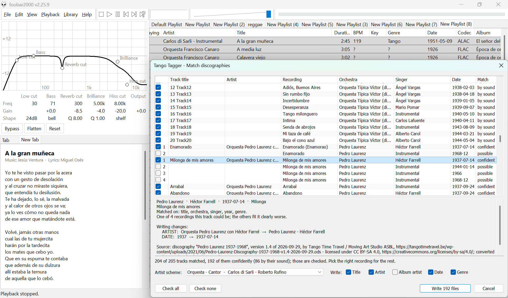

# Tango Tagger for foobar2000

Writes tango lyrics and discography data into your files.

Select tracks, right-click, **Tango Tagger > Find lyrics...**.
Each track's title is matched against the lyrics built into the component, and
the matches are listed with checkboxes; the checked ones are written to the
file. The selected row's lyrics, with composer and lyricist, are shown below
the list.

## Lyrics panel

The **Lyrics** panel shows the lyrics of the selected track (or the playing one,
per foobar2000's selection viewer preference): the file's own LYRICS /
UNSYNCED LYRICS, or else the built-in song its title matches - marked as not
in the file - with composer, lyricist and the page the text comes from.
Web addresses in the text are links and open in the default browser.

- Windows: in the Default UI layout editor it is under *Selection
  Information*. Ctrl+mouse wheel, Ctrl+Plus/Minus/0 or
  the right-click menu set the text size, kept per panel; the menu also
  toggles centring and copies the lyrics or a link.
- macOS: add the element `tango-lyrics` to the layout. Cmd+Plus/Minus/0, a
  pinch or the right-click menu set the text size.

## Matching

Titles are compared as *keys*: accents folded (Años = Anos), case, punctuation
and spaces dropped (`Yira, yira` = `Yira yira`, `¿Volverás? ¿Pero cuándo?` =
`Volveras pero cuando`). A match is always the whole key - never a prefix - so
`Cafe` does not match `Cafe Dominguez` and `Canto` does not match `Canto de amor`.

A title also answers to:

- the title without bracketed notes: `La lluvia y yo (vals)`, `[Remastered 2004]`;
- an alternative title in brackets: `Frou Frou (Fru Fru)` is found as `Fru Fru`;
- the pieces between dashes: `Carlos Di Sarli - Rie payaso - 1940`.

When nothing matches exactly, a near miss (1 edit on titles of 10+ letters, 2
on 16+) is listed as *similar* and left unchecked. A title several songs share
lists each of them, and the track's COMPOSER / LYRICIST tags pick one if they
name exactly one.

Pre-checked: exact matches onto files without lyrics. Files that already have
lyrics are listed (`same` / `different`) but left unchecked.

## Tags

| Format              | Field             | Stored as        |
|---------------------|-------------------|------------------|
| MP3                 | `UNSYNCED LYRICS` | ID3v2 USLT frame |
| MP4 / M4A           | `LYRICS`          | ©lyr atom        |
| FLAC, Ogg, Opus ... | `LYRICS`          | LYRICS field     |

With **Add links to translations** checked (the setting is kept), the lyrics
end with links to the song's translations:

    Translations:
    English, Paul Bottomer: https://www.youtube.com/watch?v=...
    Russian, tangoman: http://tango-del-dia.livejournal.com/...

They go into the same field as the lyrics. foobar2000's tag interface has no
per-language lyrics fields (FLAC and MP4 have no notion of a lyrics language
at all), and a second LYRICS value would be shown by most players instead of,
or run together with, the lyrics. Only the
links are embedded, never the translated text; they come from the
`<translation>` elements `copy-publicdomain-lyrics.ps1` keeps empty for
the purpose.

## Match discographies

**Tango Tagger > Match discographies...** finds each selected track's
recording in the orchestra discographies built into the component and fixes
its tags.

Files come half-tagged in every way, so a track is not read field by field.
Its title picks the recordings it could be: the same keys as the lyrics
matching, plus numbers spelled out (`Los 33 orientales` = `Los treinta y tres
orientales`), each side of `Palais de glace / Palé de glas`, and near misses
within the orchestra's own recordings. Everything else on the track counts as
evidence for or against each of them:

- **orchestra**: the leader's surname in ARTIST, ALBUM ARTIST, CONDUCTOR,
  PERFORMER..., the file name or its two parent folders. `Di Sarli`,
  `Disarli`, `Carlos Di Sarli y su Orquesta Típica` and, for names of six letters
  or more, one letter off (`D'Arienso`) all count. `Sexteto`/`Quartet` tells a
  leader's small ensembles apart. When the track names an orchestra, only its
  recordings are candidates. When it names none (`_elcorazonmeengano.flac` in
  a folder `78rpm`), every recording with exactly that title is offered,
  unchecked, best fitting first;
- **singer**: the recording's singers named anywhere (`Carlos Di Sarli -
  Roberto Rufino`, `Fea (Alfredo Rojas)`, a CANTOR field), or
  `Instrumental`/`Instr.`. Another of the orchestra's singers named instead
  counts against;
- **date**: a full date, a month or a year in DATE, YEAR, ORIGINAL DATE...,
  COMMENT, the title or the file name, written as `1941-10-09`, `1941.10.09`,
  `09/10/1941` or `1941–10–09`. A year far off counts against, except one after
  1990, which is the reissue's;
- **genre**: tango, vals or milonga.

A track's candidates are listed best first, at most one of them checked. The
best is pre-checked when its title and orchestra match, nothing contradicts
it, and no other candidate comes close. The rest is the user's call: two
sessions of the same tune with nothing on the file to tell them apart are
shown side by side.

What is written, and where the singer goes, is chosen below the list and
kept:

| Scheme | ARTIST | Example |
|---|---|---|
| Orquesta - Cantor | orchestra and singer | `Carlos di Sarli - Roberto Rufino`, `Carlos di Sarli - Instrumental` (TangoTunes' renamed files) |
| Orquesta / Cantor | orchestra and singer | `Carlos di Sarli / Roberto Rufino`, `Carlos di Sarli` (Tango Time Travel) |
| Cantor | the singer | `Roberto Rufino`, `Instrumental`, with the orchestra in ALBUM ARTIST (TangoTunes' own tags) |
| Orquesta, cantor in CANTOR | the orchestra | `Carlos di Sarli`, CANTOR `Roberto Rufino` |
| Orquesta; Cantor | two values | `Carlos di Sarli`, `Roberto Rufino` |

TITLE becomes the discography's title, keeping lower case notes in brackets
from the old one (`(decrackle)`, `(2)`). ALBUM ARTIST becomes the orchestra and
GENRE the discography's genre. DATE becomes the recording date, unless the
file has a more precise date within a year of it: the discographies sometimes
have only the month of a session that the label dates to the day. The preview
shows each field before and after. Fields already right are left alone.

`tools/match_recordings` runs the same matching from the command line, one
track's tags per line.

### By sound

A track the tags and file name do not place confidently - `02
Track02.wav`, or two sessions of one tune with nothing on the file to tell
them apart - is then decoded and compared by its sound with fingerprints of
known transfers of the discographies' recordings. A progress dialog shows
while that runs, several tracks at a time, below normal priority; tracks
the tags place confidently are never decoded.

A fingerprint is the chroma (the pitch content) and the strongest onsets of
the first 90 seconds of the music, measured by bpmcore from
[foo_bpm](https://github.com/shaforostoff/foo_bpm); about 800 bytes compressed. Matching
does not care about the codec, the noise, the equalisation, where the file
starts, or the turntable speed of the transfer: the speed is read off the
tuning offset, or searched over ±5% where the file was retuned or
time-stretched. What tells a recording from a re-recording of the same
arrangement is the timing: two transfers of one performance keep the same
onsets along a straight line, two performances do not.

| Match | Shown as | Checked |
|---|---|---|
| onsets agree ≥ 0.85, along a straight line | `by sound` | yes |
| onsets agree ≥ 0.70 | `sound?` | no: listen first |

Measured on 2,414 TangoTunes transfers against 800 files of two other
collections (`../fingerprint_lab`): 96% of the files whose recording has a
fingerprint are identified, 4% come out probable, 0.4% are missed. No file
was identified as a recording it is not, except where the tags it was
checked against were wrong. What lands in the probable band wrongly is
D'Arienzo, who re-recorded his 1940s arrangements in the 1950s with timing
close enough to fool the onsets - hence listen first.

The preview says which: "Matched on: sound 0.97" for a recording found by
sound alone, with the tags' evidence beside it where they named it too.

`tools/fingerprints` (`tango_fingerprints identify <folder>`) runs the same
matching - tags, then sound - from the command line.

## Data

The lyrics are read from `../xml-lyrics-publicdomain` at build time by
`tools/pack_lyrics` and embedded LZMA-compressed (7-Zip's LZMA SDK) in the
component.

The discographies are read by `tools/pack_discography` from
`../xml-discographies-cc-by-sa-4.0` - Tango Time Travel's, under CC BY-SA
4.0 - and `../xml-discographies-publicdomain`, in that order. A recording
the first folder has is left out of the second: the same orchestra and
title - spelled a little differently, numbers in digits, an article dropped
(`Tangos y copas` = `Tango y copas`, `Milonga del 83` = `Milonga del
ochenta y tres`) - and the same singers within a month, or the same title on
the same day. Each Tango Time Travel recording stands for at most one entry
of each other file.

Within the public domain folder, a `X_tangoinfo.xml` or
`X_bigwithmistakes.xml` is left out when the folder has `X.xml`, its
better alternative; Edgardo Donato, Enrique Rodríguez, Francisco Canaro
and Julio de Caro have only the tango.info file, which is used. Also left out are recordings
listed twice, such as `Anibal Troilo (all)` against `Anibal Troilo
1938-1950`. The result is about 12,500 recordings of 59 orchestras, 1,610
of them from Tango Time Travel, in 114 KB. The discographies are the same in both builds.

The audio fingerprints are read from `../xml-fingerprints` by the same
tool and embedded with the recordings they belong to: one file per
orchestra, a `<recording name vocal date fp/>` per recording, the
fingerprint base64-encoded. They are the same in both builds.
`tango_fingerprints build` makes them from collections of tagged files,
best collection first:

    tango_fingerprints build ..\xml-fingerprints build\fingerprint_cache.tsv C:\TangoTunes C:\Other ...

Each file is matched by its tags and file name, as above; a recording
matched confidently gets the fingerprint of one of its transfers - the
first, in collection order, that identifies another transfer of the same
recording, so a mislabelled file does not become a reference; or the only
one there is. Recordings whose transfers disagree are reported and left
out. ffmpeg and ffprobe decode and read the files; the cache keeps the
fingerprints between runs.

Tango Time Travel's licence asks for credit: the about box names them, the
licence and the changes made, and the match window's preview names the
discography, version, date, author and links of every recording taken from
them. The embedded discography data, being adapted from theirs, is under CC
BY-SA 4.0 too.

Two builds of the lyrics:

- **personal** (default): every lyrics file in the folder. The archive is named
  `foo_tangotagger-<version>-personal.fb2k-component` and the about box says it
  must not be distributed.
- **public domain** (`build_release.ps1 -PublicDomain`,
  `build_release_macos.sh --public-domain`, or
  `-DFOO_TANGOTAGGER_PUBLIC_DOMAIN_ONLY=ON`): only files marked
  `pd_status="public domain"`. This is the one to publish.
`tools/match_titles` runs the same matching from the command line
(`title<TAB>credits` lines on stdin).

## DeaDBeeF

`deadbeef_tangotagger/` is the same matching, data and windows as a
DeaDBeeF plugin, for Linux, macOS and Windows: see
[its README](deadbeef_tangotagger/README.md).

## Building

    powershell -ExecutionPolicy Bypass -File scripts\build_release.ps1

or on macOS `scripts/build_release_macos.sh`. The foobar2000 SDK, WTL and the
LZMA SDK are downloaded on the first configure (`scripts/get_sdk.ps1`).
bpmcore is taken from a foo_bpm checkout beside this repository's
(`../../foo_bpm`, or `-DFOO_BPM_DIR=...`), or fetched from GitHub when
there is none.

## Licence

The component's code - this folder - is under the [MIT License](LICENSE).
The data it embeds is not: Tango Time Travel's discographies, by Tango Time
Travel / Moving Art Studio ASBL, and the discography data adapted from them
are under [CC BY-SA 4.0](https://creativecommons.org/licenses/by-sa/4.0/);
the lyrics and the other discographies keep their own status. The about box
says both.
